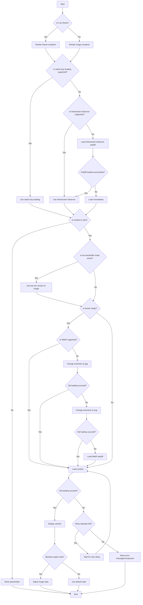

```mermaid
graph TD
    A[Start] --> B{Is it an iframe?}
    B -->|Yes| C[Render iframe container]
    B -->|No| D[Render image container]
    
    C --> E{Is native lazy loading supported?}
    D --> E
    
    E -->|Yes| F[Use native lazy loading]
    E -->|No| G{Is Intersection Observer supported?}
    
    G -->|Yes| H[Use Intersection Observer]
    G -->|No| I[Load Intersection Observer polyfill]
    I --> J{Polyfill loaded successfully?}
    J -->|Yes| H
    J -->|No| K[Load immediately]
    
    F --> L{Is content in view?}
    H --> L
    K --> L
    
    L -->|No| M[Show placeholder]
    L -->|Yes| N{Is low bandwidth mode active?}
    
    N -->|Yes| O[Use low-res version of image]
    N -->|No| P{Is format 'webp'?}
    
    O --> P
    P -->|Yes| Q{Is WebP supported?}
    P -->|No| R[Load content]
    
    Q -->|Yes| R
    Q -->|No| S[Change extension to jpg]
    S --> T{Did loading succeed?}
    
    T -->|Yes| R
    T -->|No| U[Change extension to png]
    U --> V{Did loading succeed?}
    
    V -->|Yes| R
    V -->|No| W[Load WebP polyfill]
    W --> R
    
    R --> X{Did loading succeed?}
    
    X -->|Yes| Y[Display content]
    X -->|No| Z{Retry attempts left?}
    
    Z -->|Yes| AA[Wait for retry delay]
    Z -->|No| AB[Show error message/component]
    
    AA --> R
    
    Y --> AC{Maintain aspect ratio?}
    AC -->|Yes| AD[Adjust image style]
    AC -->|No| AE[Use default style]
    
    AD --> AF[End]
    AE --> AF
    M --> AF
    AB --> AF

```
