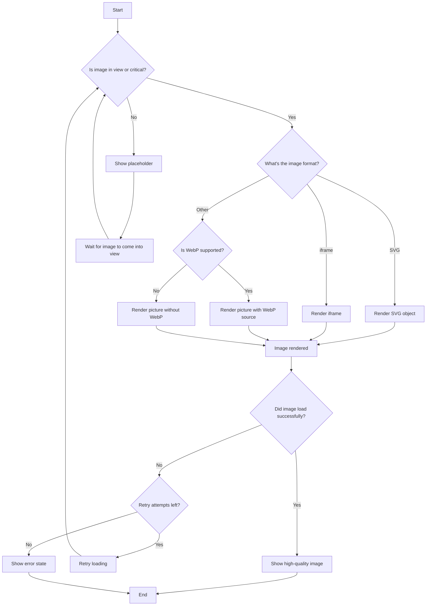

```mermaid
graph TD
    A[Start] --> B{Is image in view or critical?}
    B -->|Yes| C{What's the image format?}
    B -->|No| D[Show placeholder]
    C -->|SVG| E[Render SVG object]
    C -->|iframe| F[Render iframe]
    C -->|Other| G{Is WebP supported?}
    G -->|Yes| H[Render picture with WebP source]
    G -->|No| I[Render picture without WebP]
    D --> J[Wait for image to come into view]
    J --> B
    E --> K[Image rendered]
    F --> K
    H --> K
    I --> K
    K --> L{Did image load successfully?}
    L -->|Yes| M[Show high-quality image]
    L -->|No| N{Retry attempts left?}
    N -->|Yes| O[Retry loading]
    N -->|No| P[Show error state]
    O --> B
    M --> Q[End]
    P --> Q

```
