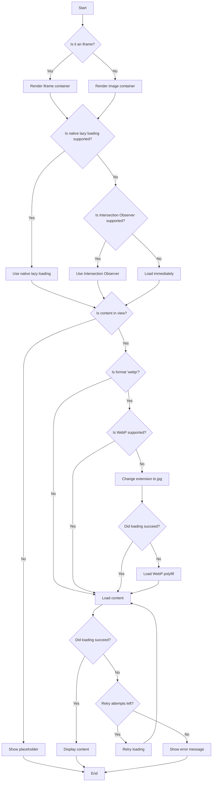

```mermaid
graph TD
    A[Start] --> B{Is it an iframe?}
    B -->|Yes| C[Render iframe container]
    B -->|No| D[Render image container]
    
    C --> E{Is native lazy loading supported?}
    D --> E
    
    E -->|Yes| F[Use native lazy loading]
    E -->|No| G{Is Intersection Observer supported?}
    
    G -->|Yes| H[Use Intersection Observer]
    G -->|No| I[Load immediately]
    
    F --> J{Is content in view?}
    H --> J
    I --> J
    
    J -->|No| K[Show placeholder]
    J -->|Yes| L{Is format 'webp'?}
    
    L -->|Yes| M{Is WebP supported?}
    L -->|No| N[Load content]
    
    M -->|Yes| N
    M -->|No| O[Change extension to jpg]
    O --> P{Did loading succeed?}
    
    P -->|Yes| N
    P -->|No| Q[Load WebP polyfill]
    Q --> N
    
    N --> R{Did loading succeed?}
    
    R -->|Yes| S[Display content]
    R -->|No| T{Retry attempts left?}
    
    T -->|Yes| U[Retry loading]
    T -->|No| V[Show error message]
    
    U --> N
    
    K --> W[End]
    S --> W
    V --> W

```
