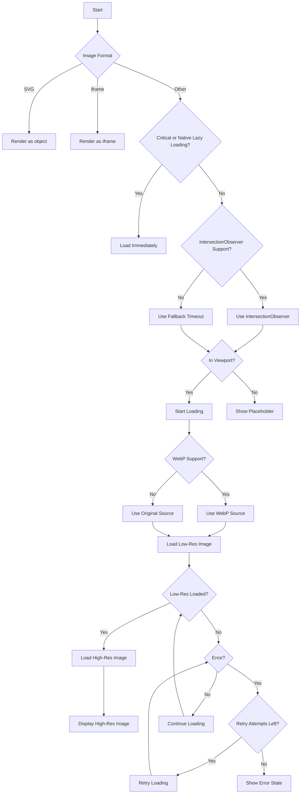

```mermaid
graph TD
    A[Start] --> B{Image Format}
    B -->|SVG| C[Render as object]
    B -->|iframe| D[Render as iframe]
    B -->|Other| E{Critical or Native Lazy Loading?}
    
    E -->|Yes| F[Load Immediately]
    E -->|No| G{IntersectionObserver Support?}
    
    G -->|Yes| H[Use IntersectionObserver]
    G -->|No| I[Use Fallback Timeout]
    
    H --> J{In Viewport?}
    I --> J
    
    J -->|Yes| K[Start Loading]
    J -->|No| L[Show Placeholder]
    
    K --> M{WebP Support?}
    
    M -->|Yes| N[Use WebP Source]
    M -->|No| O[Use Original Source]
    
    N --> P[Load Low-Res Image]
    O --> P
    
    P --> Q{Low-Res Loaded?}
    
    Q -->|Yes| R[Load High-Res Image]
    Q -->|No| S{Error?}
    
    R --> T[Display High-Res Image]
    
    S -->|Yes| U{Retry Attempts Left?}
    S -->|No| V[Continue Loading]
    
    U -->|Yes| W[Retry Loading]
    U -->|No| X[Show Error State]
    
    W --> S
    V --> Q

```
