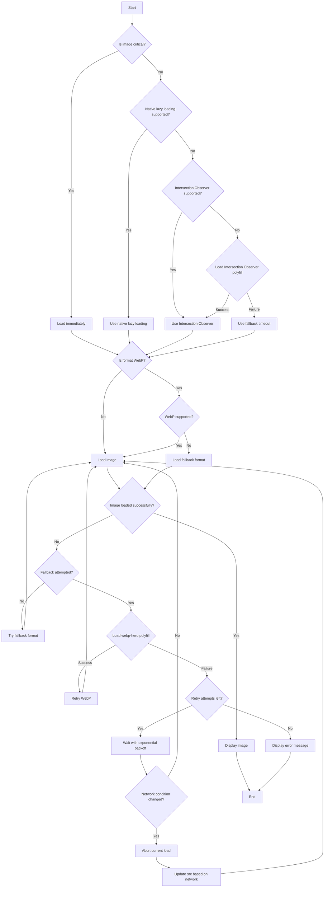

```mermaid
graph TD
    A[Start] --> B{Is image critical?}
    B -->|Yes| C[Load immediately]
    B -->|No| D{Native lazy loading supported?}
    D -->|Yes| E[Use native lazy loading]
    D -->|No| F{Intersection Observer supported?}
    F -->|Yes| G[Use Intersection Observer]
    F -->|No| H{Load Intersection Observer polyfill}
    H -->|Success| G
    H -->|Failure| I[Use fallback timeout]
    
    C --> J{Is format WebP?}
    E --> J
    G --> J
    I --> J
    
    J -->|Yes| K{WebP supported?}
    J -->|No| L[Load image]
    
    K -->|Yes| L
    K -->|No| M[Load fallback format]
    
    L --> N{Image loaded successfully?}
    M --> N
    
    N -->|Yes| O[Display image]
    N -->|No| P{Fallback attempted?}
    
    P -->|No| Q[Try fallback format]
    P -->|Yes| R{Load webp-hero polyfill}
    
    Q --> L
    
    R -->|Success| S[Retry WebP]
    R -->|Failure| T{Retry attempts left?}
    
    S --> L
    
    T -->|Yes| U[Wait with exponential backoff]
    T -->|No| V[Display error message]
    
    U --> W{Network condition changed?}
    W -->|Yes| X[Abort current load]
    W -->|No| L
    
    X --> Y[Update src based on network]
    Y --> L
    
    O --> Z[End]
    V --> Z

```
