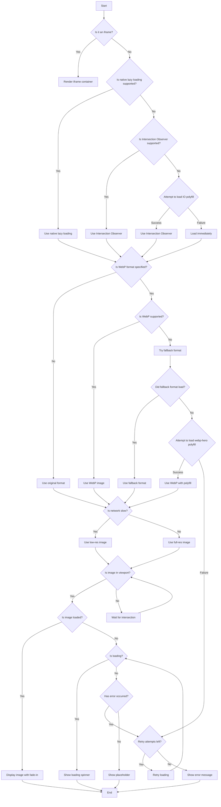

```mermaid
graph TD
    A[Start] --> B{Is it an iframe?}
    B -->|Yes| C[Render iframe container]
    B -->|No| D{Is native lazy loading supported?}
    
    D -->|Yes| E[Use native lazy loading]
    D -->|No| F{Is Intersection Observer supported?}
    
    F -->|Yes| G[Use Intersection Observer]
    F -->|No| H{Attempt to load IO polyfill}
    
    H -->|Success| I[Use Intersection Observer]
    H -->|Failure| J[Load immediately]
    
    E & G & I & J --> K{Is WebP format specified?}
    
    K -->|No| L[Use original format]
    K -->|Yes| M{Is WebP supported?}
    
    M -->|Yes| N[Use WebP image]
    M -->|No| O[Try fallback format]
    
    O --> P{Did fallback format load?}
    
    P -->|Yes| Q[Use fallback format]
    P -->|No| R{Attempt to load webp-hero polyfill}
    
    R -->|Success| S[Use WebP with polyfill]
    R -->|Failure| T{Retry attempts left?}
    
    L & N & Q & S --> U{Is network slow?}
    
    U -->|Yes| V[Use low-res image]
    U -->|No| W[Use full-res image]
    
    V & W --> X{Is image in viewport?}
    
    X -->|Yes| Y{Is image loaded?}
    X -->|No| Z[Wait for intersection]
    
    Z --> X
    
    Y -->|Yes| AA[Display image with fade-in]
    Y -->|No| AB{Is loading?}
    
    AB -->|Yes| AC[Show loading spinner]
    AB -->|No| AD{Has error occurred?}
    
    T -->|Yes| AE[Retry loading]
    T -->|No| AF[Show error message]
    
    AD -->|Yes| T
    AD -->|No| AG[Show placeholder]
    
    AE --> AB
    AA & AC & AF & AG --> AH[End]

```
