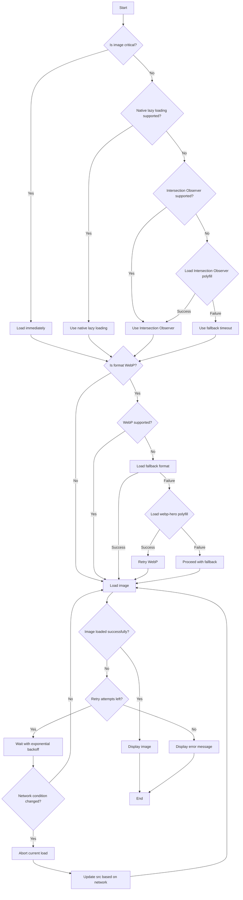

```mermaid
graph TD
    A[Start] --> B{Is image critical?}
    B -->|Yes| C[Load immediately]
    B -->|No| D{Native lazy loading supported?}
    D -->|Yes| E[Use native lazy loading]
    D -->|No| F{Intersection Observer supported?}
    F -->|Yes| G[Use Intersection Observer]
    F -->|No| H{Load Intersection Observer polyfill}
    H -->|Success| G
    H -->|Failure| I[Use fallback timeout]
    
    C --> J{Is format WebP?}
    E --> J
    G --> J
    I --> J
    
    J -->|Yes| K{WebP supported?}
    J -->|No| L[Load image]
    
    K -->|Yes| L
    K -->|No| M[Load fallback format]
    
    M -->|Success| L
    M -->|Failure| N{Load webp-hero polyfill}
    N -->|Success| O[Retry WebP]
    N -->|Failure| P[Proceed with fallback]
    
    O --> L
    P --> L
    
    L --> Q{Image loaded successfully?}
    
    Q -->|Yes| R[Display image]
    Q -->|No| S{Retry attempts left?}
    
    S -->|Yes| T[Wait with exponential backoff]
    S -->|No| U[Display error message]
    
    T --> V{Network condition changed?}
    V -->|Yes| W[Abort current load]
    V -->|No| L
    
    W --> X[Update src based on network]
    X --> L
    
    R --> Y[End]
    U --> Y

```
