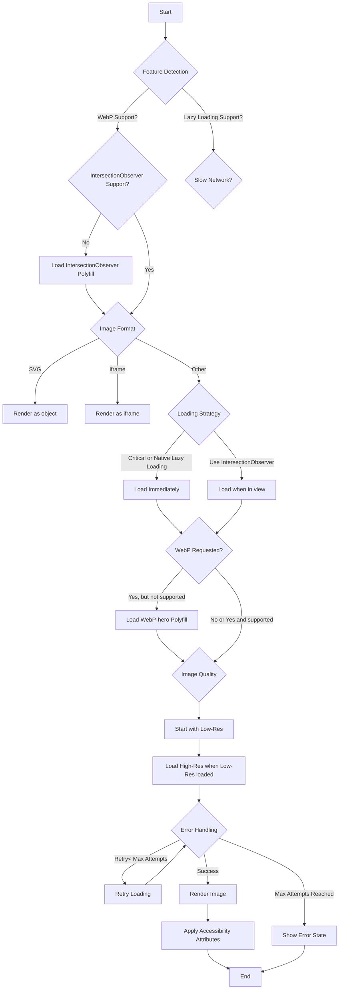

```mermaid
graph TD
    A[Start] --> B{Feature Detection}
    B -->|WebP Support?| C{IntersectionObserver Support?}
    B -->|Lazy Loading Support?| D{Slow Network?}
    
    C -->|No| E[Load IntersectionObserver Polyfill]
    E --> F{Image Format}
    
    C -->|Yes| F
    
    F -->|SVG| G[Render as object]
    F -->|iframe| H[Render as iframe]
    F -->|Other| I{Loading Strategy}
    
    I -->|Critical or Native Lazy Loading| J[Load Immediately]
    I -->|Use IntersectionObserver| K[Load when in view]
    
    J --> L{WebP Requested?}
    K --> L
    
    L -->|Yes, but not supported| M[Load WebP-hero Polyfill]
    M --> N{Image Quality}
    L -->|No or Yes and supported| N
    
    N --> O[Start with Low-Res]
    O --> P[Load High-Res when Low-Res loaded]
    
    P --> Q{Error Handling}
    Q -->|Retry< Max Attempts| R[Retry Loading]
    R --> Q
    Q -->|Max Attempts Reached| S[Show Error State]
    
    Q -->|Success| T[Render Image]
    T --> U[Apply Accessibility Attributes]
    U --> V[End]
    
    S --> V

```
