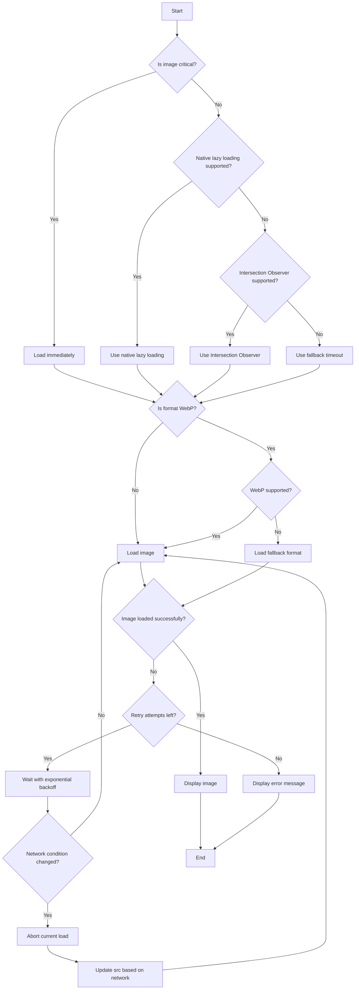

```mermaid
graph TD
    A[Start] --> B{Is image critical?}
    B -->|Yes| C[Load immediately]
    B -->|No| D{Native lazy loading supported?}
    D -->|Yes| E[Use native lazy loading]
    D -->|No| F{Intersection Observer supported?}
    F -->|Yes| G[Use Intersection Observer]
    F -->|No| H[Use fallback timeout]
    
    C --> I{Is format WebP?}
    E --> I
    G --> I
    H --> I
    
    I -->|Yes| J{WebP supported?}
    I -->|No| K[Load image]
    
    J -->|Yes| K
    J -->|No| L[Load fallback format]
    
    K --> M{Image loaded successfully?}
    L --> M
    
    M -->|Yes| N[Display image]
    M -->|No| O{Retry attempts left?}
    
    O -->|Yes| P[Wait with exponential backoff]
    O -->|No| Q[Display error message]
    
    P --> R{Network condition changed?}
    R -->|Yes| S[Abort current load]
    R -->|No| K
    
    S --> T[Update src based on network]
    T --> K
    
    N --> U[End]
    Q --> U

```
