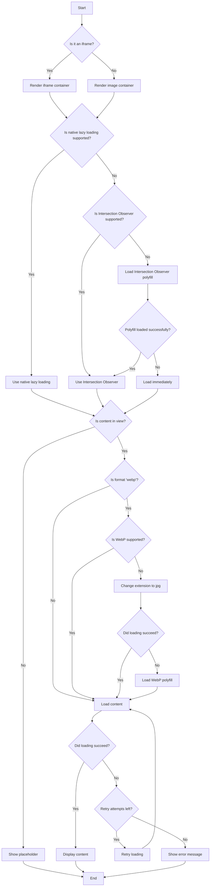

```mermaid
graph TD
    A[Start] --> B{Is it an iframe?}
    B -->|Yes| C[Render iframe container]
    B -->|No| D[Render image container]
    
    C --> E{Is native lazy loading supported?}
    D --> E
    
    E -->|Yes| F[Use native lazy loading]
    E -->|No| G{Is Intersection Observer supported?}
    
    G -->|Yes| H[Use Intersection Observer]
    G -->|No| I[Load Intersection Observer polyfill]
    I --> J{Polyfill loaded successfully?}
    J -->|Yes| H
    J -->|No| K[Load immediately]
    
    F --> L{Is content in view?}
    H --> L
    K --> L
    
    L -->|No| M[Show placeholder]
    L -->|Yes| N{Is format 'webp'?}
    
    N -->|Yes| O{Is WebP supported?}
    N -->|No| P[Load content]
    
    O -->|Yes| P
    O -->|No| Q[Change extension to jpg]
    Q --> R{Did loading succeed?}
    
    R -->|Yes| P
    R -->|No| S[Load WebP polyfill]
    S --> P
    
    P --> T{Did loading succeed?}
    
    T -->|Yes| U[Display content]
    T -->|No| V{Retry attempts left?}
    
    V -->|Yes| W[Retry loading]
    V -->|No| X[Show error message]
    
    W --> P
    
    M --> Y[End]
    U --> Y
    X --> Y

```
